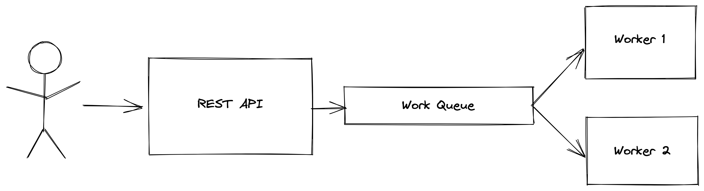

# Практика с RabbitMQ

## Описание

Цель данного проекта научиться работать с брокером сообщений [RabbitMQ](https://rabbitmq.com/getstarted.html). Был реализован сервис для генерации описания к изображениям. Пользователь может загрузить изображение, сервис должен будет сгенерировать описание к изображению, сохранить результат обработки в файл и вернуть описание пользователю при запросе.


### Архитектура сервиса

Обычно Message Queue используется для того, чтобы избежать немедленного выполнения ресурсоемкой задачи, без необходимости ждать ее завершения. Вместо этого планируется выполнить задачу позже. Например, данный паттерн часто применяется для работы с видео. В этом примере все еще можно было использовать прямое взаимодействие между REST API сервисом и сервисом генерации описаний, но использование Message Queue дает такие преимущества, как обработка отказов, если один из воркеров вдруг упадет, то сообщение не потеряется, а будет обработано другим воркером. Еще одним преимуществом использования очереди сообщений для коммуникации между сервисами является возможность масштабировать число обработчиков горизонтально в зависимости от нагрузки. Архитектура сервиса:




1. REST API сервис принимает запросы от пользователя и отправлет их в очередь RabbitMQ
2. Воркеры забирают сообщения из очереди, обрабатывают их и сохраняют в docker volume


### Интерфейс сервиса
```
POST /images
Отправляет изображение на сервер и возвращает его id. Возвращаемые id не обязаны быть последовательными, но обязаны быть уникальными.

Body:
{
    "image_url": "shorturl.at/notNY",
}

Response:
{
    "image_id": int
}
```

```
GET /images
Возвращает id всех обработанных воркерами изображений.

Response:
{
    "image_ids": List[int]
}
```

```
GET /images/<image_id>
Возвращает описание для данного изображения, если оно уже было обработано, в противном случае возвращает код 404

Response:
{
    "description": str
}
```
